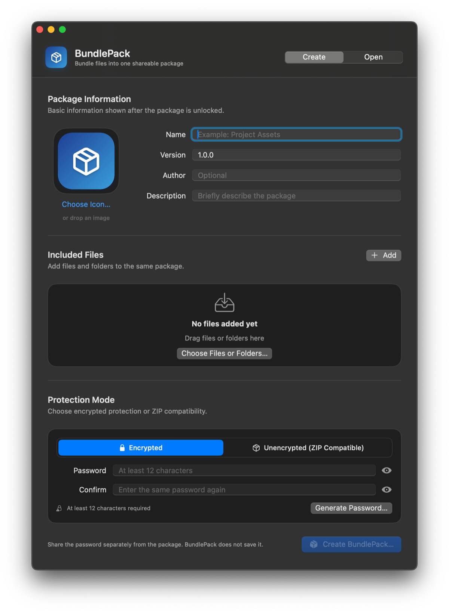
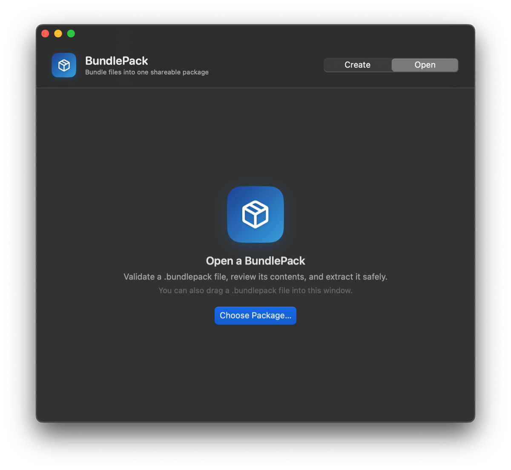
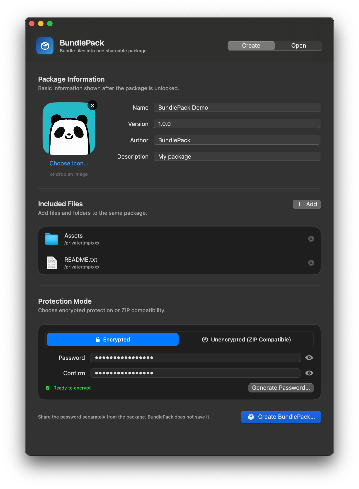
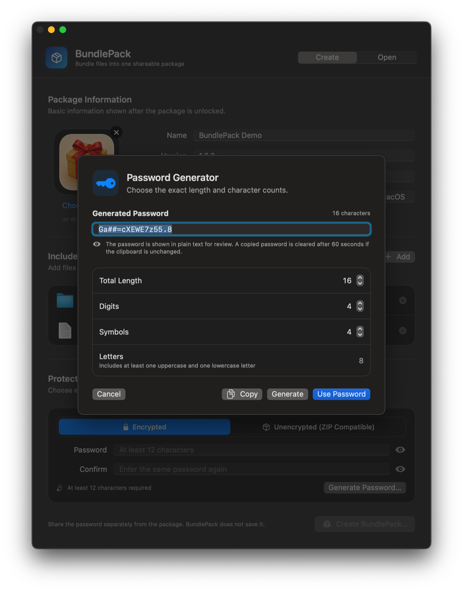
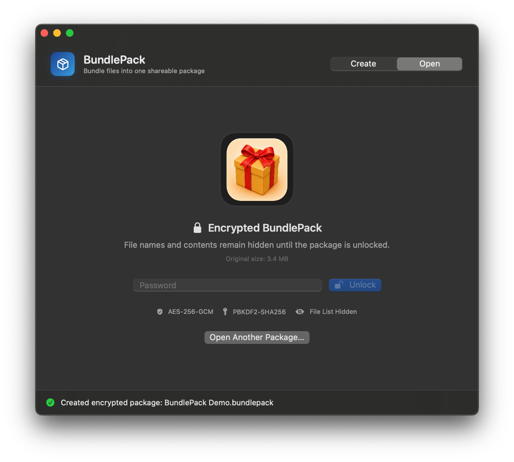
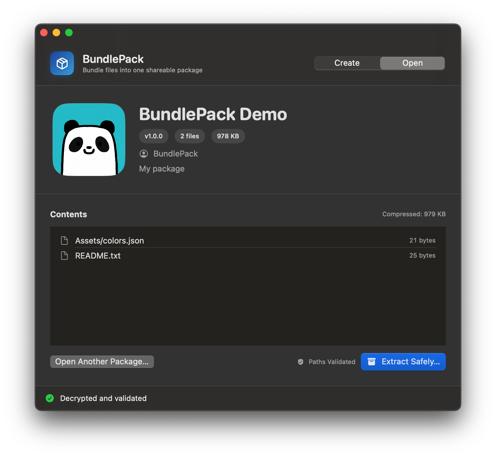

# BundlePack

BundlePack is a native macOS and Windows utility for collecting files and
folders into a shareable `.bundlepack` archive. Packages can be created and
opened on either platform. They can be encrypted for privacy or stored as
standard ZIP-compatible archives. Encryption is enabled by default.

## Highlights

- Add multiple files and folders with a file picker or drag and drop.
- Choose or drop a custom package icon stored with the package.
- Encrypt file names, metadata, ZIP structure, and file contents with AES-256-GCM.
- Create unencrypted `.bundlepack` files that remain compatible with standard ZIP tools.
- Generate strong passwords with configurable length, digit count, and symbol count.
- Open `.bundlepack` files by double-clicking, choosing a file, or dragging one into the app.
- Follow percentage progress and cancel long create, unlock, and extraction operations.
- Display each package's public custom icon in Finder and Windows Explorer thumbnails.
- Exchange packages between the native SwiftUI macOS app and native WinUI 3 Windows app.
- Run natively on Apple silicon, Intel Macs, x64 Windows, and ARM64 Windows.

## macOS Screenshots

The screenshots below show the macOS application. The Windows application
provides the same create and open workflows with native Windows controls.

### Initial Views

| Create a new package | Open an existing package |
| --- | --- |
|  |  |

### Create Workflow

| Filled package details | Built-in password generator |
| --- | --- |
|  |  |

The Create screen accepts files, folders, and a custom package icon by drag and
drop. Encrypted packages can use a manually entered password or the built-in
generator.

### Open Workflow

| Unlock an encrypted package | Review and extract validated contents |
| --- | --- |
|  |  |

## Platform Guides

The application code and platform-specific documentation are kept together.

| Platform | Native implementation | Requirements, build, and integration guide |
| --- | --- | --- |
| macOS | Swift, SwiftUI, AppKit, CryptoKit | [macOS/README.md](macOS/README.md) |
| Windows | C#, WinUI 3, .NET cryptography | [Windows/README.md](Windows/README.md) |

Pull requests and pushes to `main` are checked on both operating systems by
GitHub Actions. Windows opens the checked-in macOS fixtures and creates Windows
fixtures; macOS then opens those Windows-generated files. Successful pushes to
`main` provide test applications for macOS universal, Windows x64, Windows
ARM64, and Windows x64/ARM64 installers for seven days. Pull requests also
receive dependency review, and CodeQL analyzes the native C# and Swift sources.

Pushing a `v<version>` tag that matches the synchronized project version and
points to a commit on the default branch runs the native checks and creates or
updates a GitHub prerelease. The release gate also opens Windows-generated
fixtures on macOS. Versioned applications, installers, SHA-256 checksums, and
GitHub build-provenance attestations remain available with the release.

See [Docs/RELEASE.md](Docs/RELEASE.md) before publishing source or binaries.
Automated applications are ad-hoc signed or unsigned test builds, not trusted
end-user binaries.

## Package Format

The complete binary and ZIP layout is documented in
[Docs/FORMAT.md](Docs/FORMAT.md). The format is platform-neutral, and the Swift
and C# implementations independently enforce the same encryption, archive,
metadata, and portability rules.

### Encrypted

An encrypted package exposes only its public package icon and container
parameters. The complete inner ZIP archive is encrypted, including file names,
metadata, ZIP structure, and file contents.

```text
Sample.bundlepack
├── fixed header
├── public icon.png
└── AES-256-GCM encrypted chunks
    └── inner.zip
        ├── icon.png
        ├── manifest.json
        └── payload/
```

Keys are derived with PBKDF2-HMAC-SHA256 using 600,000 iterations. The archive
is authenticated in 4 MiB chunks, with a unique nonce and authentication tag
for every chunk. Decryption fails if the password is wrong or the package has
been modified.

The public icon is intentionally not encrypted because Finder and Explorer need
it for thumbnails. Use the default icon if a custom image could reveal private
information.

### Unencrypted

An unencrypted `.bundlepack` file is a standard ZIP archive. Rename it to
`.zip` to open it with a regular archive utility. File names, metadata, and
contents are available to ZIP-capable tools and file scanners.

## Security Boundaries

BundlePack rejects absolute archive paths, `..` traversal, symbolic links,
encrypted ZIP entries, unsupported compression methods, duplicate output
paths, and packages that exceed extraction limits. Passwords are not saved,
and there is no password recovery mechanism.

Share the password through a different channel from the package. BundlePack is
not a substitute for secure transport, endpoint security, or a reviewed backup
strategy.

Current archive limits:

- fewer than 10,000 entries;
- no individual file of 4 GB or more;
- no more than 20 GB after expansion;
- bounded UTF-8 display metadata and package-icon inputs;
- no ZIP64 inner archives.

## Project Layout

See [Docs/ARCHITECTURE.md](Docs/ARCHITECTURE.md) for component ownership,
compatibility gates, and the format-change checklist.

```text
macOS/      native macOS app, Xcode project, scripts, tests, and platform guide
Windows/    native Windows app, core library, shell integration, tests, and platform guide
Docs/       shared architecture, file-format, release, and screenshot documentation
Fixtures/   checked-in cross-platform compatibility packages
Scripts/    repository-wide cleanup, icon generation, and metadata verification
```

The platform directories intentionally mirror each other at the repository
root. Cross-platform contracts, fixtures, tooling, and repository-wide
documentation remain outside them.

## Project Status

BundlePack is experimental. Review the format and both cryptographic
implementations before relying on BundlePack for high-value or irreplaceable
data.

- See [SECURITY.md](SECURITY.md) to report vulnerabilities privately.
- See [CONTRIBUTING.md](CONTRIBUTING.md) for development and pull-request guidance.
- See [CHANGELOG.md](CHANGELOG.md) for release notes.

## License

BundlePack is available under the [MIT License](LICENSE).
