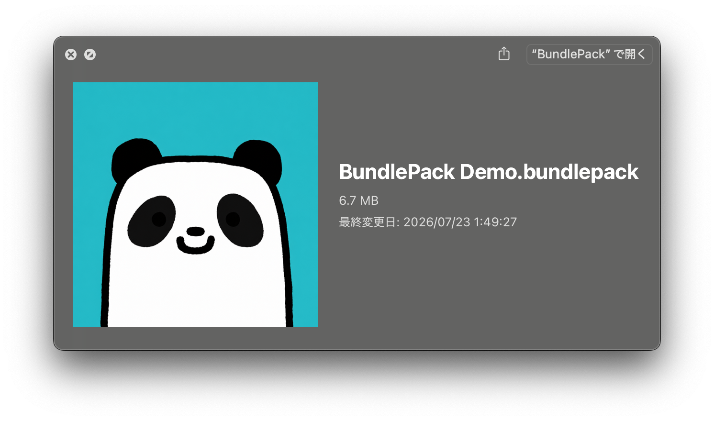
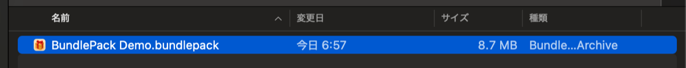

# BundlePack for macOS

This directory contains the native macOS implementation of BundlePack.

Return to the [project overview](../README.md), or read the shared
[file-format specification](../Docs/FORMAT.md).

## Components

- `BundlePack/App` contains the SwiftUI application and create/open workflows.
- `BundlePack/Shared` contains the archive, manifest, validation, and encrypted-container implementation.
- `BundlePack/ThumbnailExtension` contains the optional Finder thumbnail provider.
- `BundlePack.xcodeproj` builds the app and embeds the thumbnail extension.
- `Scripts` contains macOS build, test, release, and fixture-generation tooling.
- `Tests` contains the Swift smoke-test sources.

Repository-wide cleanup, icon generation, and metadata verification tools live
in [`../Scripts`](../Scripts). Checked-in interoperability packages live in
[`../Fixtures/Compatibility/macOS`](../Fixtures/Compatibility/macOS).

The macOS and Windows applications implement the same format independently and
do not share UI code.

## Requirements

- macOS 15 or later;
- Xcode with the macOS 15 SDK, or matching Xcode Command Line Tools.

## Build and Test

Run the scripts from the repository root:

```sh
chmod +x macOS/Scripts/*.sh
./macOS/Scripts/test.sh
./macOS/Scripts/build.sh
```

The universal Apple silicon and Intel app is written to
`.build/BundlePack.app`. You can also open
`macOS/BundlePack.xcodeproj` and build the `BundlePack` scheme in Xcode.

Remove generated macOS and Windows build output and Finder metadata with:

```sh
./Scripts/clean.sh
```

The command-line build uses an ad-hoc signature for local testing. Before
distributing the app, sign it with an Apple Developer ID and notarize it.

## CI Test Application

Every successful CI workflow run provides a
`BundlePack-macOS-universal-<commit>` artifact for 14 days. It contains a ZIP
of the universal app and its SHA-256 checksum. The app is ad-hoc signed and not
notarized, so it is intended only for short-lived testing.

## Signed Binary

Public macOS binaries require an active Apple Developer Program membership, a
**Developer ID Application** certificate, and successful notarization. An
**Apple Development** certificate or dummy identity is not a substitute.

Store notarization credentials in Keychain once:

```sh
xcrun notarytool store-credentials BundlePack
```

Then build, sign, notarize, staple, assess, and package the app with:

```sh
APPLE_SIGNING_IDENTITY="Developer ID Application: Your Name (TEAMID)" \
NOTARYTOOL_PROFILE="BundlePack" \
./macOS/Scripts/release.sh
```

The notarized archive is written to
`.build/release/BundlePack-<version>.zip`. Signing credentials and passwords
are never read from repository files. See the shared
[release checklist](../Docs/RELEASE.md) before distribution.

## Finder, Quick Look, and Custom Icons

### Installation

1. Copy `BundlePack.app` to `/Applications`.
2. Launch it once so macOS registers the `.bundlepack` document type.
3. Optionally enable **BundlePack Thumbnail** in **System Settings > General > Login Items & Extensions > Quick Look** to display embedded package icons in Finder.

Keep only one installed copy that uses the same bundle identifier.

### Standard Quick Look

BundlePack intentionally does not ship a custom Quick Look Preview extension.
Pressing Space uses macOS's standard file preview instead of a
BundlePack-specific content view. Enabling **BundlePack Thumbnail** only
provides package icons to Finder and other thumbnail surfaces; it does not
enable a custom content preview.



The extension never displays BundlePack metadata or an internal file list.

### Finder List View

The selected package icon is also shown as the compact file icon in Finder's
list view.



### Custom Package Icons

Each package can have its own icon:

- select **Choose Icon…** or drop an image onto the icon preview;
- select the remove button to return to the built-in default icon;
- BundlePack normalizes the image to a transparent 1024 × 1024 PNG and stores it as `icon.png`;
- Finder uses the embedded icon for thumbnails, and BundlePack also applies it as the file's custom icon for compact list views.

The macOS app supports PNG, JPEG, TIFF, HEIC, and SVG images. The package icon
is always public, including in encrypted packages, because Finder must read it
without a password. Do not use an image that contains private information.

Finder custom icons are also stored in macOS extended attributes. Some ZIP
tools, cloud services, or non-Mac filesystems remove those attributes during
transfer. The embedded `icon.png` remains part of the package, and opening the
package in BundlePack applies the custom Finder icon again.

If Finder displays an older preview after replacing the app, close Quick Look
and run:

```sh
qlmanage -r cache
```

## Icon Generation

`Scripts/IconGeneration/render-app-icon.swift` is the source of truth for the
macOS app icon, the Windows app icon, and both platform copies of
`DefaultPackageIcon.png`. Regenerate all checked-in icon outputs from the
repository root with:

```sh
./Scripts/generate-icons.sh
```

Intermediate `.iconset` files are created in the temporary directory and are
not stored in the repository.

## Product Identifiers

- document UTI: `com.tuki0918.bundlepack`
- app: `com.tuki0918.BundlePack`
- thumbnail extension: `com.tuki0918.BundlePack.Thumbnail`
